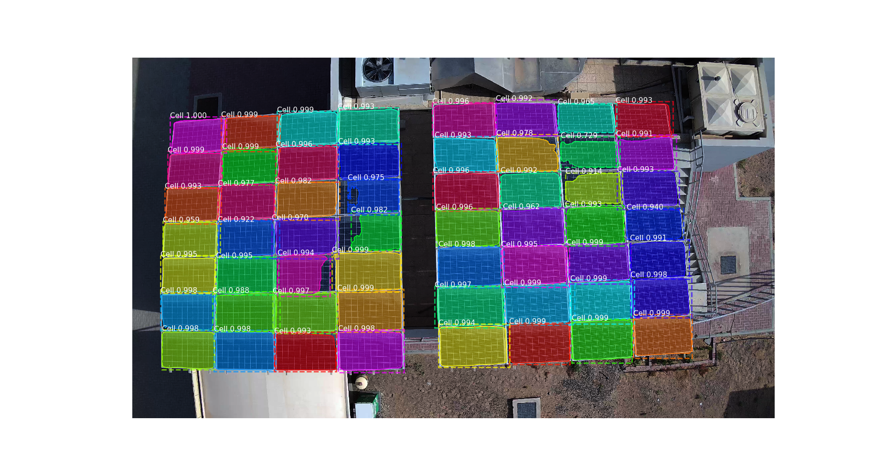

# PV panel instance segmentation using Mask R-CNN 

This is an implementation of PV panel incstance segmentation on Python 3, Keras, and TensorFlow. 
A link to the publication is here [ Enhance PV Panel Detection Using Drone Equipped With RTK ](https://asmedigitalcollection.asme.org/IMECE/proceedings-abstract/IMECE2020/84546/V07AT07A044/1099260).




This code require installation of MASK R-CNN and pycocotools before getting started.


## Installation
1. Install MASK R-CNN https://github.com/matterport/Mask_RCNN/blob/master/README.md
2. Install Pycocotools https://github.com/philferriere/cocoapi
3. Clone this repository
4. Install dependencies
   ```bash
   pip3 install -r req.txt
   ```
   
5. copy the whole repository and paste it inside Mask_RCNN/samples folder inside Mask_RCNN repository. 
   
6. Download pre-trained model weights (mask_rcnn_coco.h5) from the [releases page](https://drive.google.com/drive/folders/1T-4fhoJiUcjO9Ge3QYXPusmkzdIjhe1R?usp=sharing).

7. Download this sample input video along with srt which contains georefrence information, put the video and srt file on the samples directory. 
https://drive.google.com/drive/folders/1T-4fhoJiUcjO9Ge3QYXPusmkzdIjhe1R?usp=sharing.

8. run the track.py file.
 ```python track.py```

If you want to change the file name edit track.py code and change the video name or read it from the command line arguments. 

## Cite Our Paper
Ismail, H, Alhussein, M, Aljasmi, N, & Almazrouei, S. "Enhance PV Panel Detection Using Drone Equipped With RTK." Proceedings of the ASME 2020 International Mechanical Engineering Congress and Exposition. Volume 7A: Dynamics, Vibration, and Control. Virtual, Online. November 16–19, 2020. V07AT07A044. ASME. https://doi.org/10.1115/IMECE2020-23723
